# cryptotracker 2.0

## live

[the-eduek.github.io/cryptotracker](https://the-eduek.github.io/cryptotracker/)

cryptotracker gives users a list of top performing cryptocurrencies by market volume. users can add currencies they are interested in to a watchlist without the need for signing up or logging in. users can also make conversions from selected currencies to crypto coins in their watchlist or the more popular crypto coins.

## features

#### users can see crypto coins according to market volume
  ||
  | ------------- |
  | 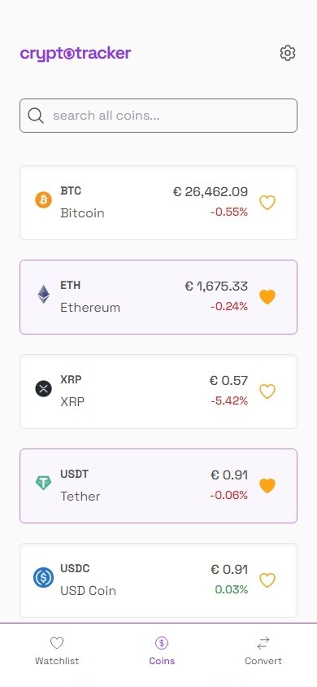 |
  | home page screenshot (v 2.0) |	


#### users can add coins to watchlist and see them anytime
  ||
  | ------------- |
  | 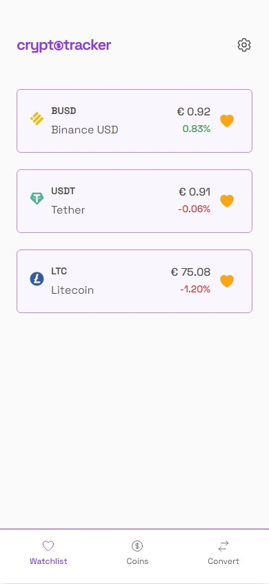 |
  | watchlist page screenshot (v 2.0) |


#### users can convert between major currencies and more popular crypto coins by default, or convert between major currencies and crypto coins in their watchlist.
  ||
  | ------------- | 
  | 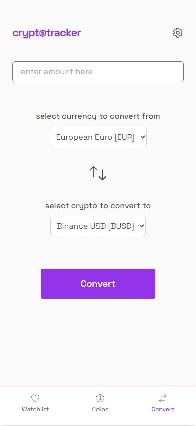 |
  | convert page screenshot (v 2.0) |


#### new settings tab for customizable user options.
  ||
  | ------------- | 
  | 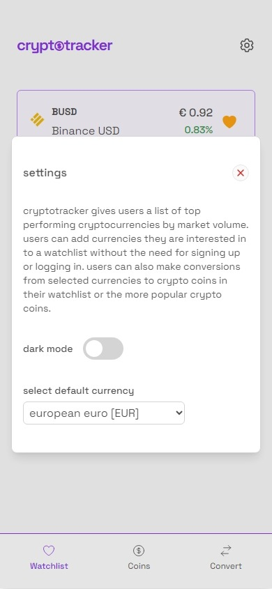 |
  | settings page screenshot (v 2.0) |


#### dark mode.
  ||||
  | ------------- | ------------- | ------------- |
  | 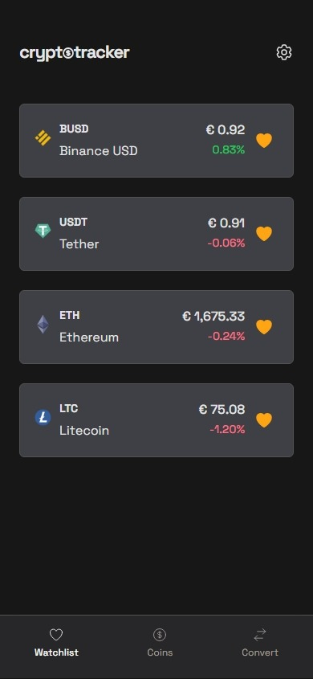 | 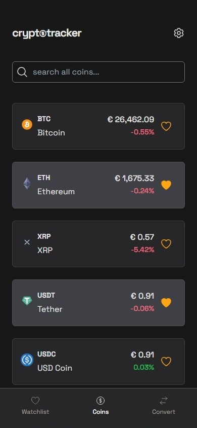 | 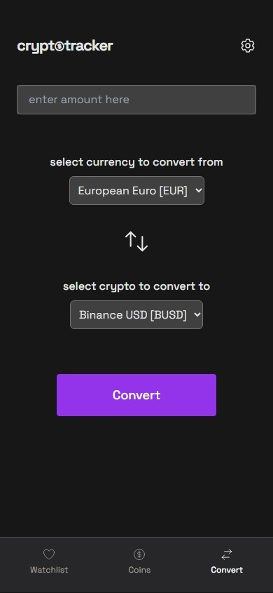 |
  | watchlist page dark mode screenshot (v 2.0) | coins page dark mode screenshot (v 2.0) | convert page dark mode screenshot (v 2.0) |


## improvements over v1

- in redesigning the app to give it a modern look, i changed the navigation icons to offer insight to the containing page information. on the old home page, there was a giant box that showed the app's default currency with no changing functionality. now the settings tab, when open, show the default currency and also allows to change currency.

  |||
  | ------------- | ------------- |
  | 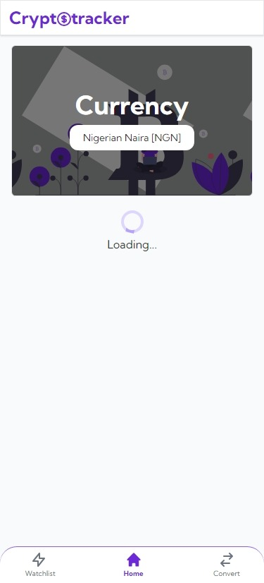 |  |
  | old home page screenshot (v 1.0) | home page screenshot (v 2.0) |


- empty state for when a user's watchlist is empty. also has a cta button that directs users to the coins page to view all coins. 

  |||
  | ------------- | ------------- |
  | 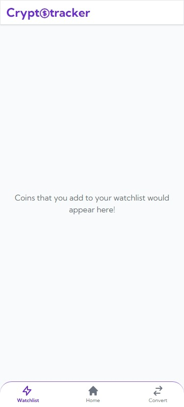 | 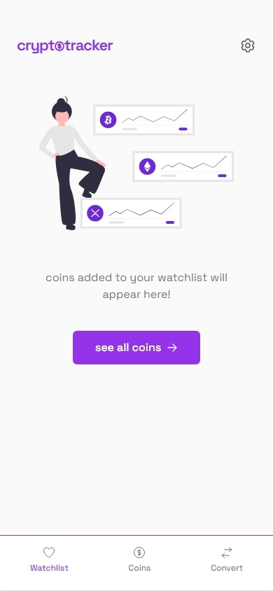 |
  | old watchlist empty page screenshot (v 1.0) | watchlist empty page screenshot (v 2.0) |


- embracing more whitespace in the convert page.

  |||
  | ------------- | ------------- |
  | 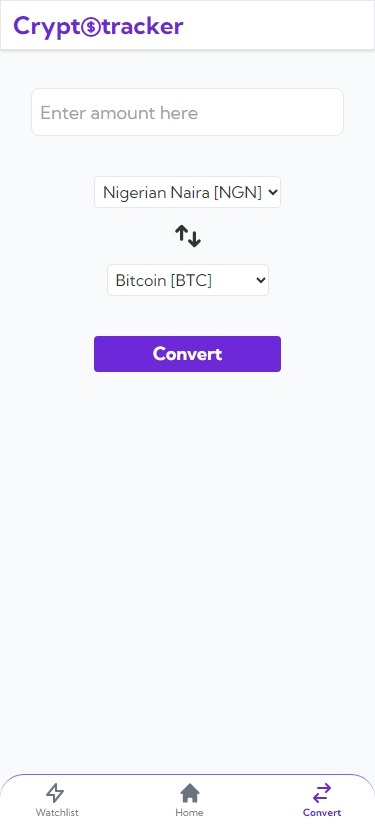 |  |
  | old convert page screenshot (v 1.0) | convert page screenshot (v 2.0) |


- changes to the conversion result modal which also responds to swipe gestures. 

  ||
  | ------------- |
  | 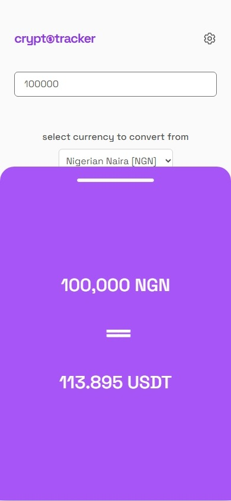 |
  | convert modal screenshot (v 2.0) |


- proper error handling. designed error states with informative messages.

  ||||
  | ------------- | ------------- | ------------- |
  | 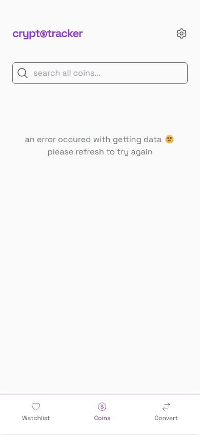 | 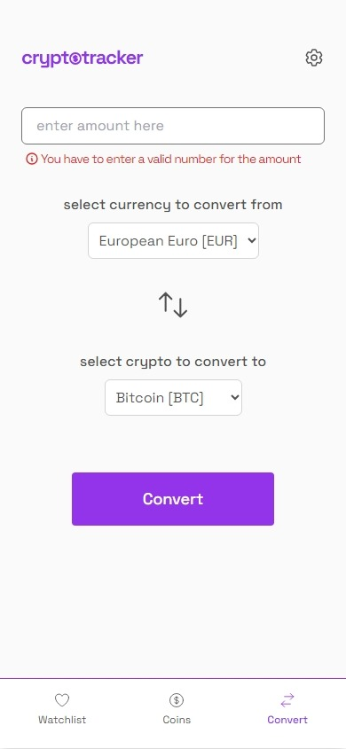 | 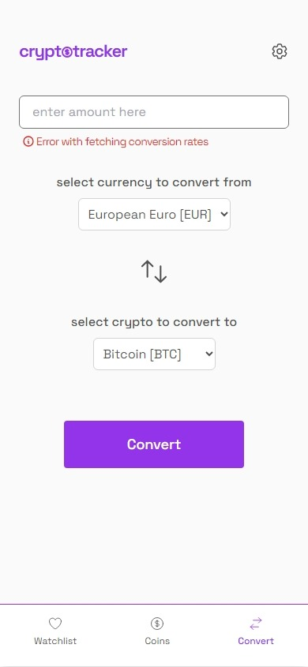 |
  | coins page error screenshot (v 2.0) | convert page value error screenshot (v 2.0) | convert page network error screenshot (v 2.0) |


- improved responsiveness

  ||||
  | ------------- | ------------- | ------------- |
  | 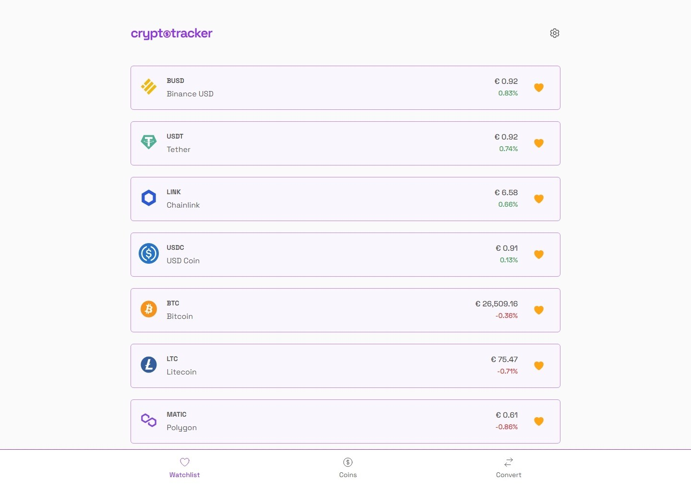 | 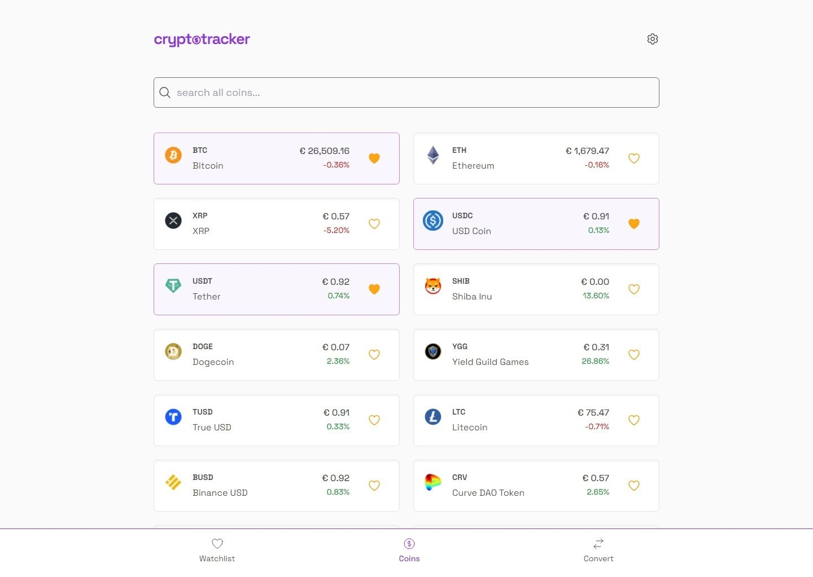 | 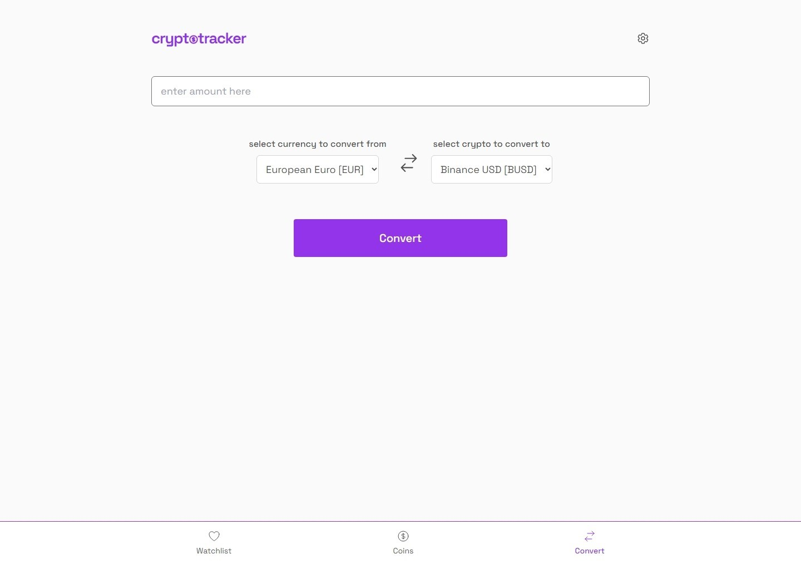 |
  | watchlist page desktop screenshot (v 2.0) | coins page desktop screenshot (v 2.0) | convert page desktop screenshot (v 2.0) |


- dark mode for improved accessibility

	

## updates

#### filter and sort coins

  users can now filter out coins they want to see by losers and gainers and this is automatically sorted by loss/gain percentage. users can now sort coins by market volume or price.

  ||
  | ------------- |
  | 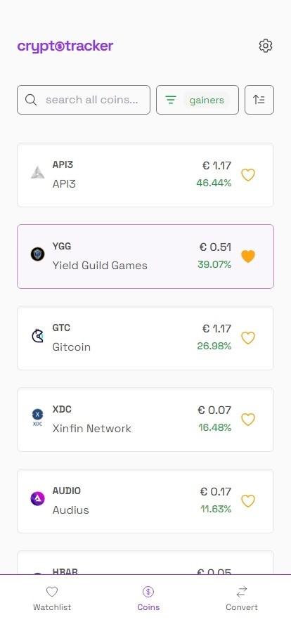 |
  | coins page modal screenshot (v 2.0) |


## project setup

this project is built with Vue 3 + TypeScript, Tailwind CSS

#### install dependencies
```bash
npm install
```


#### start the development server 
```bash
npm run dev
```
